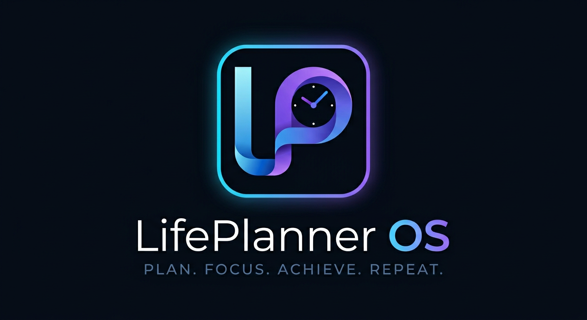

# LifePlanner OS 🧠



**LifePlanner OS** is a premium, locally-hosted Personal Operating System designed to completely eliminate decision fatigue. It is not just a to-do list—it's an automated, offline-first productivity engine that calculates what you need to do, when you need to do it, and forces you to focus.

> **Fixed in this version:** Loading screen stuck on internet issue resolved. Switched to HashRouter for universal static hosting compatibility, added IndexedDB timeout handling, PWA workbox fix, and robust error recovery UI.

---

## 🔧 What was Fixed? (Loading Stuck Issue)

If you deployed the previous version to the internet (Vercel, Netlify, GitHub Pages), you saw infinite "Loading..." screen. Root causes and fixes:

| Problem | Fix Applied |
|---|---|
| `BrowserRouter` requires server rewrite. On static hosts (GitHub Pages) without `_redirects`, direct open shows blank/404 or hangs | **Switched to `HashRouter`** (`#/` routes). Now works everywhere without server config |
| `useLiveQuery` from Dexie could stay `undefined` forever if IndexedDB blocked (private mode, storage denied) | Added `ensureDBReady()` with 6s timeout + `isIndexedDBAvailable()` check |
| No error UI — user had no way to recover | Added `LoadingScreen` with auto-help after 3.5s + `ErrorBoundary` with Reset button |
| PWA `vite-plugin-pwa` precached missing files (`favicon.ico`, `mask-icon.svg`) causing SW install failure | Fixed `includeAssets` to only existing files, added `navigateFallback: index.html`, `skipWaiting: true`, `cleanupOutdatedCaches` |
| No fallback for stale service worker | Added initial HTML loader with 10s fallback that offers Clear Cache & Reload |
| Pages returned `null` for loading without spinner | All pages now show skeleton loaders and never hang |

---

## ✨ Features

* **Zero Decision Fatigue**: The OS tells you exactly what to do based on your input capacity.
* **100% Offline & Private**: No cloud, no AI APIs, no tracking. Everything lives securely inside your browser's IndexedDB.
* **Rule Engine Integration**: Automatically forces daily fitness, rotation of study subjects, and ensures no goal is ignored for more than 2 days.
* **Live Time Calculator**: Continuously adjusts your estimated finish time and "Free Time Left".
* **Focus Mode**: Distraction-free timer for active task.
* **Installable PWA**: Works offline on iOS, Android, and Desktop as standalone app.

---

## 💻 Local Development Setup

### Prerequisites
- Node.js 18+ (check: `node -v`)
- npm 9+ or yarn/pnpm

### Steps
1. Clone:
```bash
git clone https://github.com/ARENJKY369/LIFE_BEING_EASY.git
cd LIFE_BEING_EASY
```

2. Install:
```bash
npm install
# if network slow, try:
npm install --legacy-peer-deps
```

3. Run dev server:
```bash
npm run dev
```
Open: http://localhost:5173

4. Build:
```bash
npm run build
npm run preview  # preview production build at http://localhost:4173
```

---

## ☁️ Deployment Guide (Fix for Internet Loading Issue)

### Build Output
`npm run build` creates `dist/` folder. This is static SPA. You can deploy `dist/` to any static host.

The app now uses **HashRouter** (`https://yourdomain.com/#/dashboard`) so **no server rewrite needed**. It works on all hosts out-of-box.

### Option 1: Vercel (Recommended)
1. Push code to GitHub
2. Import project on vercel.com
3. Framework preset: `Vite`
4. Build command: `npm run build`
5. Output directory: `dist`
6. Deploy. No `vercel.json` needed thanks to HashRouter, but you can add fallback:

**`vercel.json` (optional, if you switch back to BrowserRouter):**
```json
{
  "rewrites": [{ "source": "/(.*)", "destination": "/index.html" }]
}
```

### Option 2: Netlify
- Drag & drop `dist/` folder to Netlify UI, or connect GitHub repo.
- Build settings: `npm run build` / `dist`
- This repo includes `public/_redirects` which Netlify reads for SPA fallback.

### Option 3: GitHub Pages
1. **Important:** vite.config.ts has `base: './'` for relative paths.
2. Build locally: `npm run build`
3. Deploy `dist/` to `gh-pages` branch:
```bash
npm install -g gh-pages
npm run build
npx gh-pages -d dist
```
4. Or use GitHub Action:
```yaml
# .github/workflows/deploy.yml
name: Deploy
on: { push: { branches: [main] } }
jobs:
  deploy:
    runs-on: ubuntu-latest
    steps:
      - uses: actions/checkout@v4
      - uses: actions/setup-node@v4
        with: { node-version: 20 }
      - run: npm ci
      - run: npm run build
      - uses: peaceiris/actions-gh-pages@v4
        with:
          github_token: ${{ secrets.GITHUB_TOKEN }}
          publish_dir: ./dist
```

Access at `https://USERNAME.github.io/LIFE_BEING_EASY/#/dashboard` - the `/#/ ` ensures it never 404s.

We also added `public/404.html` that auto-redirects any stray path back to `/#/`.

### Option 4: Cloudflare Pages / Firebase Hosting
- Build `dist`
- No extra config needed for HashRouter. For BrowserRouter, set SPA fallback to `index.html`.

---

## 📱 Detailed Device Installation (PWA)

LifePlanner OS is a Progressive Web App. Works offline after first load.

### Common Prerequisites for PWA install to work:
- Must be served over **HTTPS** (localhost is exception)
- Visit site once online so service worker caches assets
- Chrome/Edge 89+, Safari 16.4+ recommended

### iPhone / iPad (iOS Safari) – Detailed
**Why special?** iOS doesn't allow automatic install prompt. You must use "Add to Home Screen" manually. Also iOS Private Mode blocks IndexedDB.

1. Open the app URL in **Safari** (NOT Chrome on iOS – use Safari)
2. **Disable Private Mode**: Tap tabs icon (two squares), if it says "Private" highlighted, tap Private -> choose "Tab" or "Start Page"
3. Wait for app to load past setup
4. Tap **Share icon** (square with arrow up) at bottom toolbar
5. Scroll down list > tap **Add to Home Screen**
6. You can rename to "LifePlanner" > tap **Add** top-right
7. Close Safari, find icon on home screen, open it – it will open in standalone fullscreen without Safari UI
8. **Offline test**: Enable Airplane mode > open app from home screen > should still work

**Troubleshooting iOS:**
- Stuck on Loading? Safari > Settings > Advanced > Website Data > Search your domain > Delete > reload
- Enable JavaScript: Settings > Safari > Advanced > JavaScript ON
- iOS < 16.4: Service worker limited. Update iOS.

### Android (Chrome / Edge / Brave)
1. Open app URL in **Chrome**
2. Login/setup should complete
3. You should see bottom banner "Install app" OR tap 3-dot menu top-right
4. Tap **Install app** or **Add to Home screen** or **Install**
5. Confirm Install
6. App icon appears on app drawer/home – opens standalone

**Detailed if no prompt:**
- Chrome menu > Add to Home screen > Type name > Add > Choose "Add to home screen" (not bookmark)
- Edge: Menu > Apps > Install this site as an app

**Offline:** Turn off data/WiFi > open installed app from drawer > works.

### Windows 11/10 (Chrome, Edge, Brave Desktop)
#### Method A – Address bar install (Easiest)
1. Open `https://your-deployed-url.com` in Chrome or Edge
2. Look at right side of address bar – you’ll see an **Install icon** (monitor with down arrow / plus)
3. Click it > **Install**
4. App opens in its own window, can be pinned to taskbar

#### Method B – Menu
- Chrome: 3 dots top-right > **Save and share** > **Install page as app** OR **Cast, save and share** > **Install**
- Edge: 3 dots > **Apps** > **Install this site as app** > Check "Create shortcut" > Install

#### Windows Universal:
- After install, search Start Menu for "LifePlanner" > Right-click > Pin to taskbar
- Offline works even after closing browser

### macOS (MacBook / iMac)
#### Chrome / Edge / Brave on Mac:
Same as Windows:
1. Open app in Chrome/Edge/Brave
2. Address bar -> Install icon -> Install
3. Find in Launchpad or Applications folder

#### Safari on Mac (macOS Sonoma+ supports PWA):
1. Open in Safari
2. Menu: File > Add to Dock... (on Sonoma/Ventura)
3. Or Share icon > Add to Dock
4. Opens as standalone app from Dock

### Linux (Ubuntu, etc.)
1. Use Chrome/Chromium/Edge/Brave
2. Open deployed URL
3. Address bar Install icon > Install
4. Creates `.desktop` entry in app grid
5. Works offline thanks to service worker

### Chromebook / ChromeOS
1. Open in Chrome (it's already PWA-friendly)
2. Address bar will show Install prompt automatically
3. Or launcher > Install
4. Works fully offline from shelf

---

## 🧪 Troubleshooting Loading Issue

| Symptom | Fix |
|---|---|
| Stuck on "Loading..." / spinner forever | Click **Clear Cache & Reset** button that appears after 3.5s. Or manually: open DevTools > Application > Storage > Clear site data. Also: `localStorage.clear(); indexedDB.deleteDatabase('LifePlannerDB'); location.reload()` in console |
| White screen / blank after deploy | Ensure you built with `npm run build`, not just `npm run dev`. Check hosting serves `dist/index.html`. Using HashRouter so URL must have `#/` – go to `/#/dashboard` |
| Works locally but not on GitHub Pages | GitHub Pages needs `base: './'` (already fixed). Access via `https://USERNAME.github.io/REPO/#/dashboard` not root alone. We added `404.html` redirect fix. |
| "IndexedDB blocked" message | Disable private/incognito. Chrome: Settings > Privacy > Site Settings > Storage > Allow. iPhone: Use normal Safari tab. Firefox: Settings > Privacy > Enable "Allow sites to save data" |
| PWA not installing | Check HTTPS. On localhost it works, but deployed must be HTTPS. Try hard reload: Ctrl+Shift+R (Win) Cmd+Shift+R (Mac). DevTools > Application > Service Workers > Unregister > Reload |
| Old version stuck after deploy | Vite PWA uses `autoUpdate`. But if stuck: Settings page > Reset OS & Clear All Data > Reload. Or DevTools > Application > Clear Storage |

---

## 📖 How to Use

### Phase 1: Initial Boot (Once)
Setup asks:
1. Wake-up / Sleep times
2. Learning Goals (e.g., JS, DSA, Bug Bounty)
3. Fitness Goal + session / break lengths

### Phase 2: Morning Boot (Daily)
Tab **Plan**:
- Available Hours
- Energy Level (High/Med/Low)
- Fixed Events / Urgent Tasks
- Click Generate

### Phase 3: Execution
Tab **Active** – one task at a time, start timer, complete, auto next.

### Phase 4: Review
Dashboard shows Free Time, Progress. Analytics shows charts.

---

## 🛠️ Tech Stack
React 19, Vite 6, Dexie (IndexedDB), TailwindCSS v4, Framer Motion, React Router v7 (HashRouter), vite-plugin-pwa, Recharts.

---

*Built as offline-first OS. No backend needed.*
